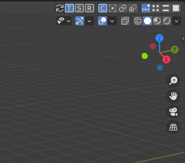

# Blender_SnapHeader
This is a plugin for blender that allows you to efficiently change the snap mode.

## How To Use

- Once installed, the following button will appear in the 3DView menu.
- Each button is a shortcut to the snap tool options, so you can change the settings by clicking on them.

